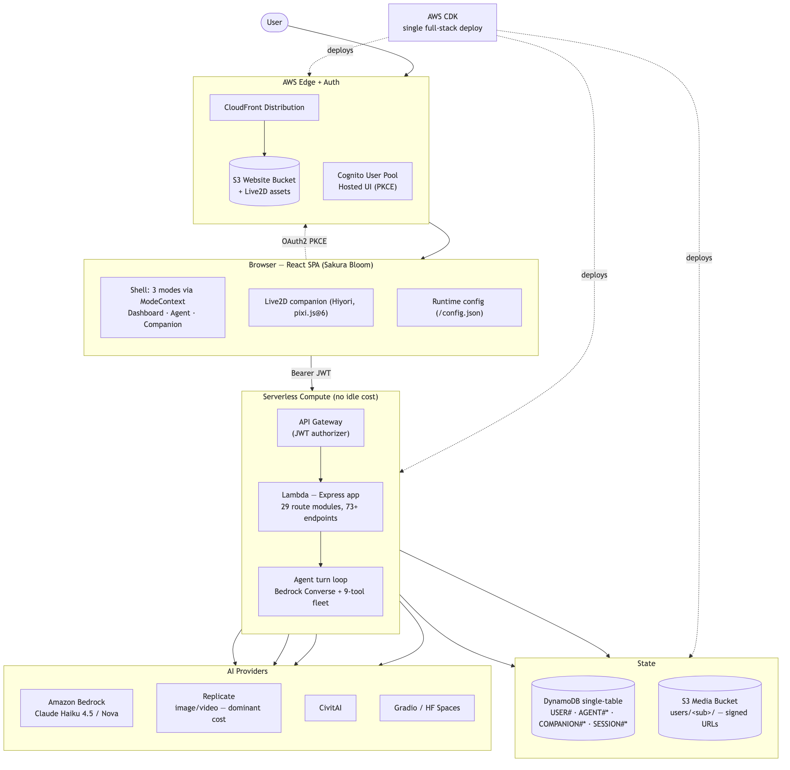

# Architecture Overview

> Last updated: 2026-06-27 (Companion Mode v0 + TTS)

This file is the current source of truth for the repo architecture, deployment modes, and branch model.
For an interview-oriented summary (system at a glance, cost model, roadmap, the "why" behind each
decision), see [`state-of-the-art.md`](./state-of-the-art.md). For the dense agent-facing reference,
see [`ai-context.md`](./ai-context.md).

## 0. Diagrams

System & deployment topology ([SVG — crisp at any zoom](./architecture-current.svg) · source [`architecture-current.mmd`](./architecture-current.mmd)):



Agent / Companion turn loop — the Bedrock Converse tool-use sequence ([SVG](./agent-turn-loop.svg) · source [`agent-turn-loop.mmd`](./agent-turn-loop.mmd)):


> Diagrams are generated from the `.mmd` sources — edit those and re-run `bash scripts/render-diagrams.sh` (never hand-edit the `.svg`/`.png`).

## 1. System Layers

| Layer | Primary Files | Notes |
|-------|---------------|------|
| Frontend | `frontend/src/` | Full Sakura Bloom React app — Live2D companion, `skr-` CSS system, 10 themes, bottom HUD |
| Backend API | `backend/index.js`, `backend/routes/**`, `backend/lib/**` | Express app wrapped for Lambda |
| Runtime config | `frontend/public/config.json` at deploy time, `frontend/src/services/runtime-config.js` | Drives API and Cognito wiring |
| Infrastructure | `cdk/bin/static-web-aws-ai-stack.ts`, `cdk/lib/*.ts`, `cdk/scripts/*.js` | Single full-stack deploy |
| Idea metadata | `IDEAS.md`, `IMPROVEMENTS.md`, `ideas/<idea-id>/**` | Registry, status, decisions, runbooks |

See [`docs/api-spec.md`](./api-spec.md) for the complete endpoint inventory with request/response shapes and public / user / admin access levels.

## 2. Branch Topology

`main` is the single development branch (backend, frontend, CDK). For new feature work, branch from `main` with a short-lived feature branch and open a PR. There are no design variants or per-idea worktrees.

## 3. Request And Runtime Flow
1. CloudFront serves the built frontend and a generated `config.json`.
2. The frontend resolves:
   - `apiBaseUrl`
   - `cognito.domain`
   - `cognito.clientId`
   - `cognito.userPoolId`
   - `cognito.region`
3. The frontend sends the user through Cognito Hosted UI using PKCE.
4. API Gateway invokes the Lambda adapter in `backend/lambda.js`.
5. Express route handlers execute domain logic and call external providers.
6. Metadata is stored in DynamoDB and user media is stored in S3.

## 4. Deployment

### 4.1 Full Stack (the only stack — deployed from `main`)
- Stack file: `cdk/lib/static-web-aws-ai-stack.ts`
- Entry point: `cdk/bin/static-web-aws-ai-stack.ts`
- Resources created:
  - S3 website bucket
  - CloudFront distribution
  - API Gateway
  - Lambda
  - Cognito user pool + client + hosted domain
  - DynamoDB media table
- Deploy command: `npm --prefix cdk run idea:deploy -- --stage=dev`

### 4.2 Live2D Asset Deployment
Live2D model assets (~50 MB) are excluded from the CDK `BucketDeployment` (which uses a Lambda that would time out). After CDK deploys, `idea-env.js` automatically syncs them:
```sh
aws s3 sync frontend/build/live2d s3://<bucket>/live2d
```
`prune: false` is set on `BucketDeployment` to preserve these assets between deploys.

## 5. Backend Composition

### 5.1 Dependency Wiring
- Composition root: `backend/lib/build-deps.js`
- This is where provider clients, stores, helpers, and middleware are assembled.
- New shared dependencies should be wired here first, then passed into route modules.

### 5.2 Route Registration
- Route registration hub: `backend/routes/index.js`
- All route modules use the **Express Router** pattern — each module exports a function that returns a `Router`, which `index.js` mounts via `app.use()`.
- Registered route modules: 29
- Total endpoints: 73+

#### Dependency flow
```
backend/index.js
  └── build-deps.js          (composition root — assembles all deps)
       └── routes/index.js   (registerRoutes — mounts all Routers)
            ├── core-prompt.js
            ├── bedrock-routes.js  /  bedrock-image-video-route.js
            ├── replicate-image-routes.js  /  replicate-image-status-select-routes.js
            ├── replicate-video-routes.js
            ├── civitai-image-routes.js
            ├── gradio-routes.js
            ├── story-message-route.js
            ├── character-routes.js
            ├── companion-route.js
            ├── operations-routes.js
            ├── media/              (user-media, user-video, shared-media)
            ├── story/              (seed, session, session-item, illustration, animation, music, music-library, music-selection)
            └── lora/               (catalog, profile)
```

| Route File | Domain | Mount Prefix |
|------------|--------|--------------|
| `core-prompt.js` | health, hello, prompt helper | `/` |
| `media/user-media-routes.js` | user image list/upload/share/delete | `/` |
| `media/user-video-routes.js` | user video list/stream/share/delete | `/` |
| `media/shared-media-routes.js` | public shared images and videos | `/` |
| `bedrock-routes.js` | Bedrock prompt helper | `/` |
| `bedrock-image-video-route.js` | Nova Reel image-to-video | `/` |
| `replicate-image-routes.js` | Replicate image generation | `/` |
| `replicate-image-status-select-routes.js` | Replicate image polling + selection | `/` |
| `replicate-video-routes.js` | Replicate video generation + polling | `/` |
| `civitai-image-routes.js` | CivitAI generation + polling | `/` |
| `gradio-routes.js` | Gradio image generation | `/` |
| `story/seed-routes.js` | story presets and characters | `/story` |
| `story/session-routes.js` | session CRUD | `/story` |
| `story/session-item-routes.js` | per-session item ops | `/story` |
| `story-message-route.js` | story messaging | `/` |
| `story/illustration-routes.js` | scene illustrations | `/story` |
| `story/animation-routes.js` | scene animation | `/story` |
| `story/music-routes.js` | scene music generation | `/story` |
| `story/music-library-routes.js` | music library CRUD | `/story` |
| `story/music-selection-routes.js` | assign library track to scene | `/story` |
| `operations-routes.js` | director ops, masonry, jobs | `/` |
| `lora/catalog-routes.js` | LoRA catalog | `/` |
| `lora/profile-routes.js` | LoRA profiles | `/` |
| `character-routes.js` | character CRUD | `/` |
| `companion-route.js` | companion AI chat + memory | `/` |
| `agent-route.js` | **Agent mode (v1.7)** — Bedrock Converse + tool-use turn endpoint | `/` |
| `agent-suggest-route.js` | Bedrock single-field suggestion helper (used by Whisk "Let Hiyori choose" buttons) | `/` |
| `agent-admin-route.js` | Sanctum admin endpoints — GET/PUT `/api/admin/agent/model`, GET `/api/admin/agent/cost` | `/` |
| `agent-sessions-route.js` | GET/POST/PATCH/DELETE `/api/agent/sessions` — named conversation sessions (v1.7) | `/` |

### 5.3 Frontend (Sakura Bloom)
The Sakura Bloom frontend is the primary UI, living in `frontend/src/` on `main`:
- Live2D companion (Hiyori) rendered via `pixi-live2d-display@0.4.0` + `pixi.js@6`
- Bottom HUD navigation (Realm / Atelier / Chronicle / Sanctum)
- 10 themes (sakura, moonrise, bamboo, ember, void, glacier, dusk, aurora, crimson, storm) with dark/light brightness variants
- Companion memory via DynamoDB, proactive companion via AI-generated messages
- **Modes (v0 companion + v1.7 agent)** — `ModeContext` (localStorage `skr-mode`) switches the whole shell between three surfaces: `dashboard` (form-UI), `agent` (route-scoped to `/atelier`, the manga-panel `AgentStage`), and `companion` (full-viewport character takeover that refuses admin operations). `AgentContext` owns the turn stream, serial submit queue, intent confirm/abort chain, slash command dispatcher, voice input, TTS, and the active session id (localStorage `skr-agent-session`). **9-tool fleet**: `generate_image`, `set_theme`, `continue_story`, `illustrate_scene`, `recall_favorites`, `generate_music`, `browse_gallery`, plus companion v0's `view_my_creations` and `what_can_you_do`. See ADR-007, `docs/proposals/agent-mode-v0.md`, and `docs/proposals/companion-mode-v0.md`.
- `skr-` CSS class prefix system with custom properties in `src/styles/tokens.css`. Agent-mode CSS lives in its own `src/styles/agent.css` module.

See [`frontend/ARCHITECTURE.md`](../frontend/ARCHITECTURE.md) for component tree, hook graph, and CSS design system details.

### 5.4 Critical Backend Contracts
- Auth middleware: `backend/lib/auth.js`
- Storage keys: `backend/lib/keys.js`
- Story seed data and prompt-helper options: `backend/config/story-seed-data.js`
- Model/provider definitions: `backend/config/models.js`
- Companion memory: `backend/lib/companion-memory.js`

## 6. Data And Storage Model

### 6.1 DynamoDB
- Table key shape:
  - partition key: `pk`
  - sort key: `sk`
- User partition root: `USER#<sub>`
- Story preset namespace: `PRESET#STORY`
- Story character namespace: `PRESET#CHARACTER`
- Prompt helper namespace: `PRESET#PROMPT_HELPER`
- Companion memory: `COMPANION#<modelId>`, `COMPANION#<modelId>#MSG#<ts13>`
- **Agent memory**: `AGENT#<modelId>`, `AGENT#<modelId>#MSG#<ts13>` — separate
  namespace from `COMPANION#` because agent task context (short-lived, tool-call
  heavy) shouldn't pollute the long-lived companion identity memory.
  - `turnCount` is incremented atomically via `UpdateExpression: ADD turnCount :n` (eliminates the read-modify-write race between concurrent saves).
  - Rolling summary compaction kicks in at `turnCount > 30`. See `backend/lib/agent-memory.js`.
- **Agent cross-session prefs (v1)**: `AGENT#STATE` — single record per user,
  not per model. Stores `{ lastStyle, lastAspect, lastLora, theme }`. Read on
  every agent turn and injected into the system prompt as `<prefs>…</prefs>`
  so the model biases tool defaults toward what the user has chosen before.
  Values are enum-validated (`validatePrefValue`) on both write AND read — the
  field flows into the system prompt, so an unchecked value would enable a
  self-targeted prompt-injection. See `backend/lib/agent-state.js`.
- **Agent rate-limit bucket**: `AGENT#RATE` — token-bucket counter per user
  (capacity 30, refill 1/2s on `/turn`; capacity 60, refill 1/s on `/suggest`).
  Module: `backend/lib/agent-rate-limit.js`.
- **Agent cost telemetry**: `AGENT#COST` — per-user running totals
  `{ inputTokens, outputTokens, turnCount, tokensToday, dayStartedAt }`.
  Atomic `ADD` increments. Powers the daily token cap (200k/day, UTC midnight
  rollover) and the Sanctum cost dashboard. Compaction summariser tokens
  (every ~30 turns) also bill here. See `backend/lib/agent-cost.js`.
- **Agent image cap counter**: `AGENT#IMG_COUNT` — separate daily counter
  capping image generations (default 50/day) to bound Replicate spend, the
  dominant cost driver. Lives apart from `AGENT#COST` so the image cap rolls
  over independently of the token cap.
- **Agent sessions (v1.7)**: `AGENT#SESSION#{sessionId}` — named conversation
  sessions `{ name, createdAt, lastUsedAt }`. The session id doubles as the
  memory namespace (replaces the legacy "modelId" segment in `AGENT#{id}` and
  `AGENT#{id}#MSG#…`), so per-session conversation history works without a
  schema change. Sanitised via `sanitiseSessionId` on both write and read.
- **Agent model config**: `CONFIG#AGENT` — admin override of the Bedrock model
  id used by `/turn` and `/suggest`. 60s in-memory cache. Configurable via the
  Sanctum AgentModel section. See `backend/lib/agent-config.js`.

### 6.2 S3
- User-owned media prefix: `users/<sub>/`
- Authorization helpers enforce that a user can only operate on keys under their own prefix.

## 7. Idea Metadata Model
- `IDEAS.md` is the top-level registry.
- The `ideas/dev/` folder contains:
  - `README.md`
  - `DECISIONS.md`
  - `RUNBOOK.md`
  - `STATUS.md`
  - `IMPROVEMENTS.md`
  - optional `cdk-outputs.json`

## 8. Validation And Completion Rules

See `CONTRIBUTING.md` for the full PR checklist and `docs/testing.md` for all quality gates. Backend/CDK changes are only complete after deploy + sanity + UI smoke.

## 9. Current Risks
- Backend test coverage is still ~40% — expand test coverage for new routes.
- `story/illustration-routes.js` is still very large and may need future decomposition.
